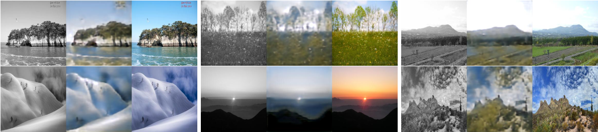
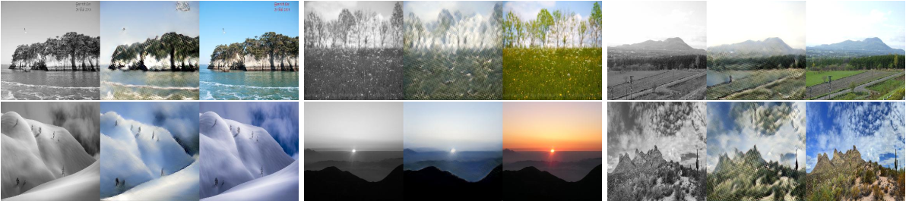
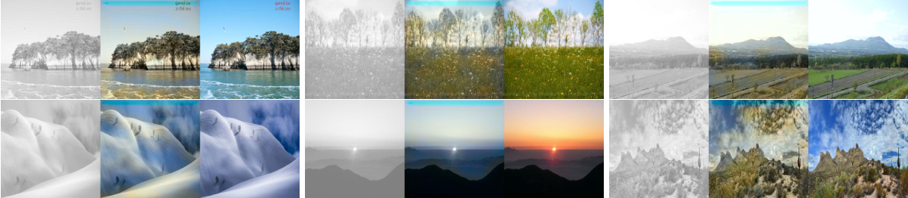
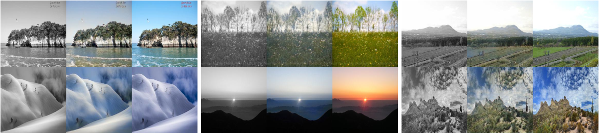
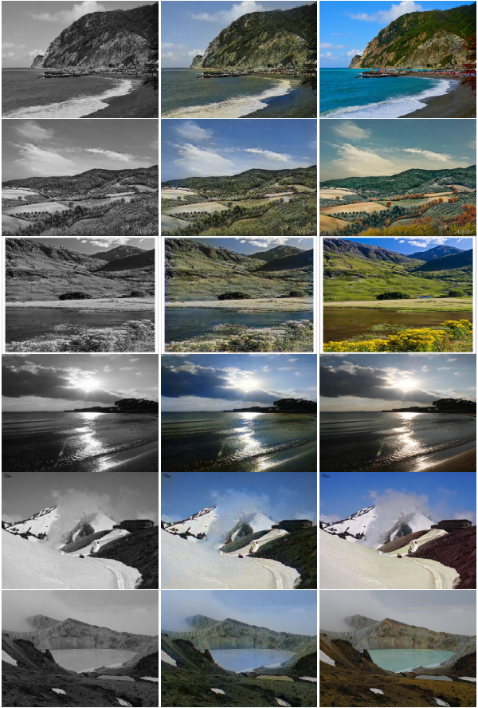
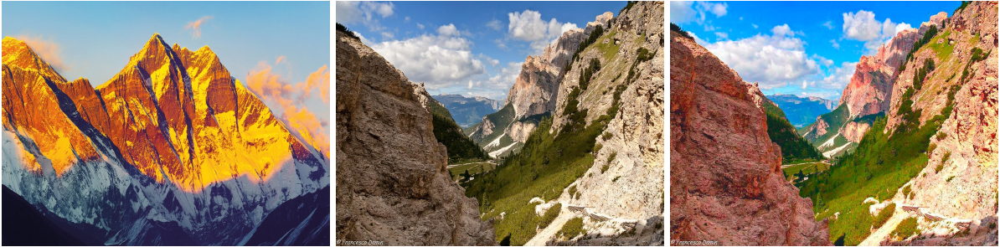

# Image Colorization and Mood Transfer

## Evaluation Metrics

* **PSNR.** Peak Signal to Noise Ratio - averaged across all channels. The higher the better. Even though studies have shown PSNR is a poor judge of image quality, I included them nevertheless.

* **LPIPS.** Learned Perceptual Image Patch Similiarity. The lower the better[3]. This work uses Alex net model to score the prediction and target image perceptual similarity score.

### Why these metrics work?

From intuition and experiment, I saw PSNR and SSIM metrics did not serve as a good judgement metric. In fact, the SSIM metric did not waiver that much throughout the validation procedure. However, I saw a qualitative correlation between the LPIPS score and output images. Hence, the best model was chosen based on it’s LPIPS score. Implicit goal of colorizing an image is to restore missing information. MSE score based metric tend to favor toward a desaturated color. Hence, the best judge of colorization has to be a human being or a model that mimics human judgement.

## Experimenting with the Model

### Only L2 Loss

The basic model with L2 loss achieved PSNR 32.22 and LPIPS 0.62. The LPIPS score is way too bad. This is backed up by the outputs in Figure 1. For every image the middle one is the prediction from the model. The output looks ok, but it’s quite apparent that high frequency information (e.g. edges) is missing. Output from base model with L2 loss. For every figure, left most one is the grayscale input, middle one
prediction and right most one is the ground truth:



### LPIPS Loss

L2 loss is doing a decent job, but can we do better? To this end, I added the LPIPS loss proposed by [3]. With other parameters unchanged, the model achieved PSNR 28.82 and LPIPS 0.37. Obviously, the LPIPS score improved since the model is minimizing it. From qualitative point of view, the outputs look more pleasing. The color saturation starts to match the target saturation. I included the output of the same inputs in Figure 2. Taking a closer look the new output has high frequency artifacts in it. Output from base model with LPIPS loss. For every figure, left most one is the grayscale input, middle one prediction and right most one is the ground truth:



### CIELAB Color Space

At this point, I started taking look at other color spaces. CIEL*a*b color space is excellent at decoupling the luma channel (L) from the RGB component. In addition, the color difference in LAB spcae align closely with the perceptual dissimilarity in human. Therefore, I redefined the model to output in 2 channels (a and b). The new dataloader is made with channels normalized to be in range [0, 1].

The luma channel (equivalent to grayscale image) is used as input, and ab channel as the target. This is the intuitive choice because the goal is to restore color. The luma channel of the original image will provide the high frequency component. The loss function is kept at L2. LPIPS uses RGB image in the loss function. Converting LAB to RGB is computationally expensive and to respect time constraint of the assignment, I decided to leave it unexplored for now. The new model achieved PSNR 36.06 and LPIPS 0.26. It improved the metrics quite a lot. The output of the same images are shown in Figure 3. Honestly, it looks quite good. High frequency artifacts are gone. But it has a glaring blue artifact at the top of every image. My assumption is upsampling is pushing the channel values out of the color gamut. In addition, the colors are little bit desaturated compared to the second variant of the model. Output from base model with L2 loss and LAB images. For every figure, left most one is the grayscale input, middle one prediction and right most one is the ground truth:



### Best of both variants
Can we take the best parts of both variants and get a better looking output? LPIPS variant model has a high frequency artifact and original high frequency details are smudged out. Whereas the LAB variant has out of bounds artifacts and desaturated color channels. To get the best of both of these variants, I ran a post process routine. The output from the model is converted to LAB color space. Then, only the AB components are used along with the L channel of the original grayscale image to reconstruct the image. Output from base model with LPIPS loss and post processing. For every figure, left most one is the grayscale input, middle one prediction and right most one is the ground truth



From above figure, the outputs retain high frequency details, does not have any glaring artifacts and the colors look more saturated/natural. Table 1 shows all the results from all the experiments.

| Model             |     PSNR       |     LPIPS      |
|:------------------|:--------------:|:--------------:|
| RGB + L2 Loss     |    32.22       |     0.62       |
| RGB + LPIPS Loss  |    28.82       |     0.37       |
| LAB + L2 Loss     |    36.06       |     0.26       |

## Qualitative Output

Output from base model with LPIPS loss and post processing. First column is the grayscale image, second the model output, third the actual ground truth.



## Color Transfer

A naive but brilliant approach to color transfer is to transform the image so the new image has the distribution with same mean and standard deviation of the source image [1]. Following his work, I implemented simple color transfer method in script color transfer .py. First, the color is converted LAB color space. Then, the mean and standard deviation of the target image is scaled and shifted to match with that of the source image.



However, there is one fundamental problem with this. If a dominant color is present throughout the image, then it will bias the mean toward that color. For example, the source image has 80% sky and target image has 10% sky. The transformed image will lose visual realism. So, this approach mandates using images with similar composition.

The authors suggested to use swatches to reduce such effect. To implement it, I divided the source image into two clusters. The cluster mean and standard deviation is used to transform a pair of target images. Blending these two images with the inverse distance from the cluster center to get the final image. However, this did not yield satisfactory results. Even after normalizing the distance by cluster standard deviation. The notebook directory contains the experiment. Working part of the color transfer is scripted in the project directory.

## Running the Code

### Setup

Repository contains the conda environment with necessary packages to run the code in ```env.yml``` file.

`$ conda env create -f env.yml`

This would create `py39` environment.

Create train and val directory under data. And make the train and validation images available there (copy over or symbolic link). Alternatively, you can change the TRAIN_DIR and VAL_DIR in the cfg file.

### Training

To train with RGB image, and LPIPS loss:

`$ python main.py --cfg configs/train_base.yaml`

To train with RGB image and L2 loss:

`$ python main.py --cfg configs/train_base_l2.yaml`

To train with LAB image and L2 loss:

`$ python main.py --cfg configs/train_base_lab.yaml`

To evaluate a checkpoint:

`$ python main.py --cfg configs/train_base.yaml --evaluate --ckpt_name ckpt_best.pth.tar`

To evaluate the other checkpoints simply replace the ```--cfg``` to either ```configs/train_base.yaml``` or ```configs/train_base_l2.yaml```.

### Inference

To run inference with the pretrained model on a input directory, run

`$ python inference.py --cfg pretrained/configs/train_base_lpips.yaml --inp data/test --out output/inference/base --ckpt_name ckpt_best.pth.tar`

```--cfg``` : Config file to load model. My final model config file: ```configs/train_base.yaml``` 

```--inp``` : Input image file or directory

```--out``` : Output directory

```--ckpt_name``` : Checkpoint name, best model checkpointed at ```ckpt_best.pth.tar```

### Color/Mood Transfer

To run the script:

`$ python color_transfer.py --src test_inp/d2.jpg --target data/train/3132.jpg --out new_name.jpg`

```--src``` : Source image to take the color/mood from

```--target``` : Target image that will get modified to the source mood

```--out``` : Output image file location

## References

[1] E. Reinhard et al. “Color transfer between images”. In: IEEE Computer Graphics and Applications 21.5 (2001), pp. 34–41. doi: 10.1109/38.946629.

[2] Richard Zhang, Phillip Isola, and Alexei A Efros. “Colorful Image Colorization”. In: ECCV. 2016.

[3] Richard Zhang et al. The Unreasonable Effectiveness of Deep Features as a Perceptual Metric. 2018. arXiv: 1801.03924 [cs.CV].